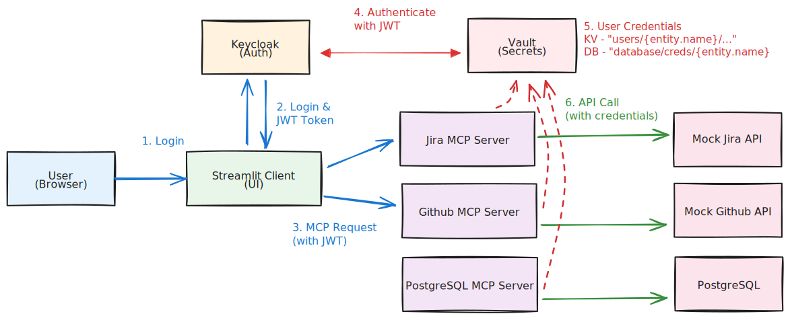

# MCP Remote Vault Demo

Korean README is available [here](README(KR).md)

A system demo that uses HashiCorp Vault to manage user-specific dynamic credentials for MCP (Model Context Protocol) servers.

## Objective

The core objective is to verify that Remote MCP Servers correctly retrieve different credentials for each user.

The HashiCorp blog post [Validated Patterns: AI Agent Identity with HashiCorp Vault](https://developer.hashicorp.com/validated-patterns/vault/ai-agent-identity-with-hashicorp-vault) explains using JWT On-Behalf-Of (OBO) tokens for MCP authentication. However, for user-specific credential management, this implementation uses JWT's `sub` claim to create Entities and creates Entity aliases linked to the JWT auth method for each Entity.

## Architecture



## Demo


### Components

- **Keycloak**: User authentication and JWT issuance
- **HashiCorp Vault**: JWT-based authentication and user-specific credential management (using Policy Templating)
  - **KV Secrets Engine**: Stores Jira and Github credentials
  - **Database Secrets Engine**: Generates dynamic PostgreSQL credentials
- **PostgreSQL**: Relational database (for MCP servers)
- **Streamlit Client**: Web UI for selecting and using MCP servers, authentication flow tracing, and credential debugging information
- **Remote MCP Servers** (FastMCP-based):
  - **Jira MCP Server**: Manages Jira issues and projects
  - **Github MCP Server**: Manages GitHub repositories and issues
  - **PostgreSQL MCP Server**: Queries and manages PostgreSQL database
- **Mock Backend Services**: Simulates Jira and Github APIs

### Data Flow

1. **Initialization**: The `init-vault.sh` script queries Keycloak for user list and pre-creates Vault Entities for each user (Entity name = username, e.g., "alice", "bob"). Creates Entity aliases linked to JWT auth method for each Entity (alias name = user UUID, JWT's `sub` claim value).
2. **User Authentication**: User logs in to Keycloak via Streamlit Client and receives JWT token (JWT's `sub` claim contains user UUID)
3. **MCP Request**: Streamlit Client sends request to selected MCP server(s) with JWT token (multiple selection possible)
4. **Vault Authentication**: When MCP server passes JWT to Vault, Vault validates JWT signature via Keycloak's JWKS URL and finds existing Entity by linking alias
5. **Credential Retrieval**:
   - **KV Secrets (Jira, Github)**: Access to user-specific paths (`secret/data/users/{{identity.entity.name}}/*`) is allowed via Vault Policy Templating, and MCP server retrieves credentials using Entity name
   - **Database Secrets (PostgreSQL)**: Dynamic database credentials are generated via Vault Database Secrets Engine (`database/creds/{{identity.entity.name}}`)
6. **API/DB Call**: MCP server calls Mock API or PostgreSQL database using credentials retrieved from Vault

## Key Concepts

### User-Specific Credential Separation

Each user can only retrieve their own credentials:

1. **Entity Pre-creation**: The `init-vault.sh` script queries Keycloak for user list and pre-creates Vault Entities for each user. Entity name is set to username (e.g., "alice", "bob") for easy identification by administrators.
2. **Entity Alias Linking**: Creates Entity aliases linked to JWT auth method for each Entity. Alias name is set to user UUID (JWT's `sub` claim value) to match with JWT.
3. **User Authentication**: User logs in to Keycloak and receives JWT token (JWT's `sub` claim contains user UUID)
4. **Vault Authentication**: When MCP server passes JWT to Vault, Vault validates JWT signature using Keycloak's public key and finds existing Entity alias using JWT's `sub` claim to link Entity.
5. **Policy Templating**: The following path access is allowed via Vault Policy Templating:
   - **KV Secrets**: `secret/data/users/{{identity.entity.name}}/*` (Jira, Github)
   - **Database Secrets**: `database/creds/{{identity.entity.name}}`, `database/roles/{{identity.entity.name}}` (PostgreSQL)
   Entity name is username, so administrators can easily track it.
6. **Credential Retrieval**:
   - **KV Secrets**: MCP server uses Entity name to retrieve credentials from `secret/data/users/{entity_name}/jira` or `secret/data/users/{entity_name}/github` paths.
   - **Database Secrets**: MCP server uses Entity name to generate dynamic database credentials from `database/creds/{entity_name}` path.
7. **Access Control**: Each user can only retrieve their own credentials and cannot access other users' credentials.

### Keycloak-Vault Integration

Vault validates JWT tokens using Keycloak's JWKS URL:

- **JWKS URL**: `http://keycloak:8080/realms/mcp-demo/protocol/openid-connect/certs`
- **Configuration Location**: Set in `init-vault.sh` script with the following command:
  ```bash
  vault write auth/jwt/config \
    jwks_url="http://keycloak:8080/realms/mcp-demo/protocol/openid-connect/certs" \
    bound_issuer="http://localhost:8080/realms/mcp-demo"
  ```
- **How It Works**:
  1. Vault retrieves Keycloak's public key from JWKS URL
  2. Validates JWT signature using public key
  3. Verifies JWT's `iss` claim matches Keycloak's issuer via `bound_issuer`
  4. On successful validation, creates Entity based on JWT's `sub` claim

## Getting Started

Prerequisites:
- Docker and Docker Compose installed
- curl and Python 3

### 1. Start Services

```bash
docker-compose up -d
```

### 2. Initialize Keycloak

Wait for Keycloak to start (approximately 30 seconds), then run initialization script:

```bash
./init-keycloak.sh
```

### 3. Initialize Vault

After Vault starts, run initialization script:

```bash
./init-vault.sh
```

This script performs the following:
- Enables JWT authentication method
- Configures Keycloak integration
- Enables KV secrets engine (for Jira, Github)
- Enables Database secrets engine (for PostgreSQL)
- Configures PostgreSQL connection and creates dynamic roles
- Queries user list from Keycloak
- Pre-creates Vault Entities for each user (Entity name = username, e.g., "alice", "bob")
- Creates Entity aliases linked to JWT auth method for each Entity (alias name = user UUID)
- Creates user-specific policies using Policy Templating (`{{identity.entity.name}}`)
- Creates JWT role
- Initializes user-specific credentials (alice: Jira, Github, PostgreSQL / bob: Github, PostgreSQL)

### 4. Verify User Credentials

The `init-vault.sh` script automatically creates the following credentials:

- **alice**: All credentials created (Jira, Github, PostgreSQL)
- **bob**: Only Github and PostgreSQL credentials created (no Jira - for demo purposes)

To manually verify or modify:

```bash
# Check Alice's Jira credentials
docker exec -e VAULT_TOKEN=root-token vault vault kv get secret/users/alice/jira

# Check Alice's Github credentials
docker exec -e VAULT_TOKEN=root-token vault vault kv get secret/users/alice/github

# Check Alice's PostgreSQL role
docker exec -e VAULT_TOKEN=root-token vault vault read database/roles/alice

# Check Bob's Github credentials
docker exec -e VAULT_TOKEN=root-token vault vault kv get secret/users/bob/github

# Check Bob's PostgreSQL role
docker exec -e VAULT_TOKEN=root-token vault vault read database/roles/bob
```

**Note**: Entity names use usernames (alice, bob) for easy management.

## Usage

### 1. Access Streamlit Client

Open http://localhost:8501 in your browser

### 2. Login

- **Username**: `alice` or `bob`
- **Password**: `alice123` or `bob123`

### 3. Select MCP Server and Load Tools

- Select one or more MCP servers (multiple selection via checkboxes):
  - **Jira**: Manage Jira issues and projects
  - **Github**: Manage GitHub repositories and issues
  - **PostgreSQL**: Query and manage PostgreSQL database
- Click "Load Tools" button

**Authentication Flow Trace**: The following information is automatically displayed when clicking "Load Tools":
- **Step 1-2**: User login and JWT issuance information
- **Step 3**: MCP server request status
- **Step 4-5**: Vault authentication and Entity information
- **Step 6**: Credential status for each MCP server
  - User ID (JWT's `sub` claim)
  - Username, Email
  - Vault path
  - Masked credentials (partial display for security)
  - Credential existence and error information

### 4. Use Tools

Expand each tool, enter required parameters, and click "Execute" button

## Demo Scenarios

### Scenario 1: Verify User-Specific Credential Separation

1. **Login as alice**
   - Login with `alice` / `alice123` in Streamlit
   - Select MCP server(s) (e.g., one or more of Jira, Github, PostgreSQL)
   - Click "Load Tools"
   - Verify credential information in Authentication Flow Trace:
     - User ID: alice's UUID (JWT's `sub` claim)
     - Entity Name: `alice` (pre-created Entity name, uses username)
     - Vault Path:
       - Jira: `secret/data/users/alice/jira`
       - Github: `secret/data/users/alice/github`
       - PostgreSQL: `database/creds/alice`
     - Credentials: alice's credentials (displayed for each MCP server)

2. **Login as bob** (different browser/incognito mode)
   - Login with `bob` / `bob123` in Streamlit
   - Select same MCP server(s)
   - Click "Load Tools"
   - Verify credential information in Authentication Flow Trace:
     - User ID: bob's UUID (different from alice, JWT's `sub` claim)
     - Entity Name: `bob` (pre-created Entity name, uses username)
     - Vault Path:
       - Jira: No credentials (Step 6 shows failure)
       - Github: `secret/data/users/bob/github`
       - PostgreSQL: `database/creds/bob`
     - Credentials: bob's credentials (different from alice)

**Result**: Verify that each user only retrieves their own credentials

### Scenario 2: Execute MCP Tools

1. Select tool (e.g., `get_issue`)
2. Enter parameters (e.g., `issue_key`: PROJ-1)
3. Click "Execute"
4. Verify results (Mock API called with user's credentials)

## Service Ports

- **Keycloak**: http://localhost:8080
- **Vault**: http://localhost:8200 (UI: http://localhost:8200/ui, root token: `root-token`)
- **PostgreSQL**: localhost:5432
- **Streamlit Client**: http://localhost:8501
- **Jira MCP Server**: http://localhost:3001
- **Github MCP Server**: http://localhost:3002
- **PostgreSQL MCP Server**: http://localhost:3003
- **Mock Jira API**: http://localhost:8001
- **Mock Github API**: http://localhost:8002

## File Structure

```
mcp-remote/
├── docker-compose.yml          # All service definitions
├── init-keycloak.sh            # Keycloak initialization script
├── init-vault.sh               # Vault initialization script
├── README.md                   # This document
├── flow-chart.svg              # Architecture diagram
├── vault/
│   ├── config.hcl              # Vault configuration
│   └── setup.sh                # Vault setup script
├── keycloak/
│   └── (directory - currently unused)
├── mcp-servers/
│   ├── jira-server/
│   │   ├── main.py             # Jira MCP server
│   │   ├── requirements.txt    # Python dependencies
│   │   └── Dockerfile          # Docker image definition
│   ├── github-server/
│   │   ├── main.py             # Github MCP server
│   │   ├── requirements.txt    # Python dependencies
│   │   └── Dockerfile          # Docker image definition
│   └── postgresql-server/
│       ├── main.py             # PostgreSQL MCP server
│       ├── requirements.txt    # Python dependencies
│       └── Dockerfile          # Docker image definition
├── streamlit-client/
│   ├── app.py                  # Streamlit web UI
│   ├── auth_trace.py           # Authentication flow tracing module
│   ├── requirements.txt        # Python dependencies
│   ├── Dockerfile              # Docker image definition
│   └── .streamlit/
│       └── config.toml         # Streamlit configuration
├── init-postgresql.sql         # PostgreSQL initialization script
└── mock-services/
    ├── jira-api/
    │   ├── main.py             # Mock Jira API
    │   ├── requirements.txt    # Python dependencies
    │   └── Dockerfile          # Docker image definition
    └── github-api/
        ├── main.py             # Mock Github API
        ├── requirements.txt    # Python dependencies
        └── Dockerfile          # Docker image definition
```

## Troubleshooting

### Keycloak Not Starting

PostgreSQL must start first:

```bash
docker-compose logs postgres
docker-compose logs keycloak
docker-compose restart keycloak
```

### Vault Configuration Error

Wait for Vault to fully start:

```bash
docker exec -e VAULT_TOKEN=root-token vault vault status
docker-compose logs vault
```

### MCP Server Connection Error

Check service logs:

```bash
docker-compose logs jira-mcp-server
docker-compose logs github-mcp-server
```

### Credential Retrieval Failure

Verify Vault policies are correctly configured:

```bash
docker exec -e VAULT_TOKEN=root-token vault vault policy read user-secrets
docker-compose logs vault
```

## Cleanup

Stop all services:

```bash
docker-compose down
```

Remove volumes:

```bash
docker-compose down -v
```

## Technology Stack

- **FastMCP**: Python framework for MCP server implementation
- **FastAPI**: Provides HTTP endpoints for MCP servers
- **Policy Templating**: Vault's dynamic policy generation feature (using `{{identity.entity.name}}`)
- **JWT Authentication**: Authentication between Keycloak and Vault
- **Vault Database Secrets Engine**: Generates dynamic PostgreSQL credentials
- **Streamlit**: Web UI and authentication flow trace visualization

## References

- [HashiCorp Vault Documentation](https://developer.hashicorp.com/vault)
- [Vault Policy Templating](https://developer.hashicorp.com/vault/tutorials/policies/policy-templating)
- [MCP Remote Protocol](https://modelcontextprotocol.io/docs/develop/connect-remote-servers)
- [Keycloak Documentation](https://www.keycloak.org/documentation)
- [FastMCP](https://github.com/jlowin/fastmcp)
- [Validated Patterns: AI Agent Identity with HashiCorp Vault](https://developer.hashicorp.com/validated-patterns/vault/ai-agent-identity-with-hashicorp-vault)

