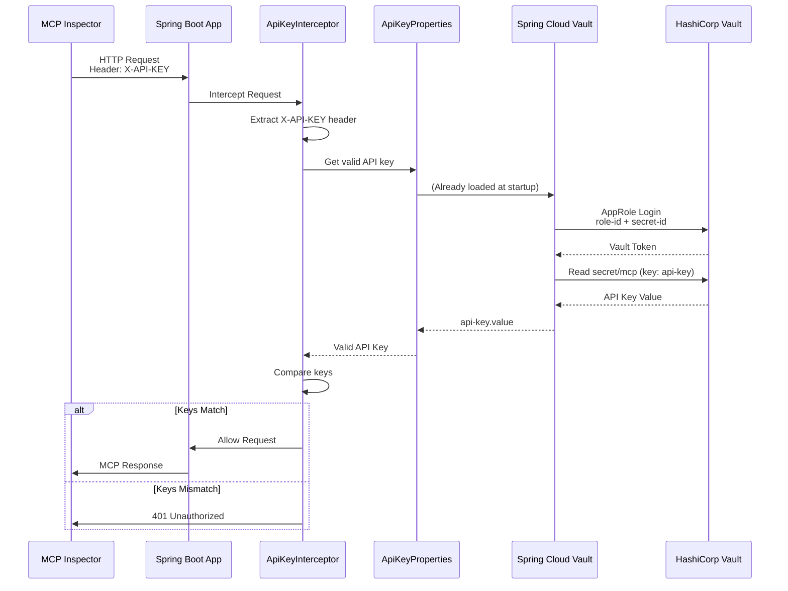
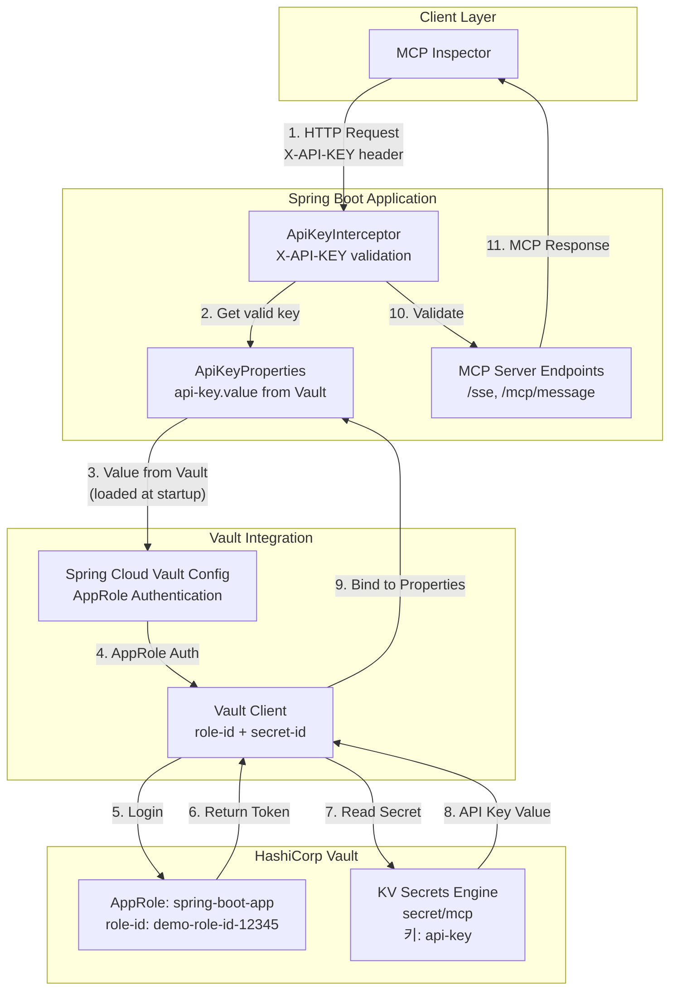

# Spring AI MCP 서버 HashiCorp Vault 보안 구성

HashiCorp Vault를 사용하여 API 키를 관리하고 AppRole 인증을 사용하는 보안 Spring AI Model Context Protocol (MCP) 서버 구현입니다.

[English Documentation](README.md)

## 개요

이 프로젝트는 HashiCorp Vault를 사용하여 Spring AI MCP 서버의 API 키를 관리하는 방법을 보여줍니다. API 키는 Vault에 안전하게 저장되며 AppRole 인증을 사용하여 런타임에 조회됩니다.

**참고**: 이 프로젝트는 중앙 집중식 Secret 관리를 위해 HashiCorp Vault를 사용하며, [DZone 기사의 Spring Security 접근 방식](https://dzone.com/articles/how-to-secure-a-spring-ai-mcp-server-with-an-api-k)의 대안입니다. DZone 기사는 Spring Security와 `mcp-server-security` 모듈을 사용한 API 키 인증을 다루는 반면, 이 프로젝트는 Secret 저장 및 관리를 위해 Vault를 사용하여 중앙 집중식 Secret 관리, 감사 로깅, 버전 관리 기능을 제공합니다.

### Vault를 사용하는 이유

**중앙 집중식 Secret 관리의 필요성:**
- 여러 서비스와 환경에 걸쳐 Secret의 단일 소스 제공
- Secret 분산 방지: 코드, 설정 파일, 여러 저장소에 흩어진 Secret을 한 곳에서 관리
- 일관된 보안 정책 적용: 로테이션 일정, 최소 권한 원칙, 암호화 표준 등을 모든 애플리케이션에 통일 적용

**API Key 관리 방식 비교:**

| 방식 | Vault 사용 시 | Vault 미사용 시 |
|------|--------------|----------------|
| **저장 위치** | 중앙 집중식 저장소 (암호화됨) | 코드, 설정 파일, 환경 변수 (평문 또는 간단한 암호화) |
| **접근 제어** | 세밀한 정책 기반 접근 제어 | 파일 권한 또는 환경 변수 관리에 의존 |
| **감사 로깅** | 모든 Secret 접근이 자동 로깅 | 수동 로깅 또는 로깅 없음 |
| **버전 관리** | Secret 버전 관리 및 롤백 지원 | 버전 관리 어려움 |
| **Secret 로테이션** | 자동 로테이션 지원 (구현 시) | 수동 로테이션, 애플리케이션 재시작 필요 |
| **다중 환경** | 환경별 다른 Secret 자동 관리 | 환경 변수 또는 설정 파일 수동 관리 |
| **규정 준수** | 감사 추적 및 규정 준수 요구사항 지원 | 추가 구현 필요 |

**Spring Security 대비 Vault의 장점:**

Spring Security는 애플리케이션 내부의 인증/인가에 특화되어 있지만, Secret 관리 측면에서 Vault는 다음과 같은 장점을 제공합니다:

- **중앙 집중식 관리**: 여러 서비스와 환경에서 Secret을 통합 관리
- **동적 Secret**: 필요 시 생성되고 자동으로 만료되는 단기 Secret 지원
- **자동 로테이션**: Secret 자동 로테이션으로 보안 강화
- **감사 로깅**: 모든 Secret 접근에 대한 상세한 감사 추적
- **규정 준수**: PCI-DSS, HIPAA 등 규정 준수 요구사항 지원
- **암호화 서비스**: Transit Secret Engine을 통한 암호화/복호화 서비스 제공
- **다양한 인증 방법**: AppRole, Kubernetes, AWS IAM 등 다양한 인증 방법 지원

**적용 시나리오:**
- 마이크로서비스 아키텍처에서 여러 서비스 간 Secret 공유
- 규제 산업에서 감사 추적 및 규정 준수 요구
- 클라우드/멀티 클라우드 환경에서 일관된 Secret 관리
- 자동 Secret 로테이션이 필요한 환경
- 중앙 집중식 보안 정책 적용이 필요한 조직

**고려사항:**
- Vault는 별도의 인프라 운영이 필요하며, 고가용성 구성 시 추가 리소스 필요
- 네트워크 지연 및 Vault 가용성에 대한 의존성 존재
- 초기 설정 및 학습 곡선이 있음

이 프로젝트는 Vault를 사용한 API Key 관리의 기본 구현을 보여주며, 프로덕션 환경에서는 위의 장점들을 활용할 수 있습니다.

## 아키텍처

```
MCP Inspector/Client
    │
    │ HTTP 요청 (X-API-KEY 헤더)
    ▼
Spring Boot 애플리케이션
    │
    ├── API 키 Interceptor (X-API-KEY 헤더 검증)
    │
    └── MCP 서버 엔드포인트 (Spring AI MCP)
    │
    │ Vault API 호출
    ▼
HashiCorp Vault (Docker)
    └── API 키 저장소 (secret/mcp, 키: api-key)
```

## 사전 요구사항

- Docker 및 Docker Compose
- Java 21 이상
- Maven 3.6 이상

## 빠른 시작

다음 명령을 실행하세요:

```bash
./setup.sh
```

이 스크립트는 다음을 자동으로 수행합니다:
- Vault 컨테이너 시작 (이미 실행 중이면 스킵)
- Vault가 준비될 때까지 대기
- KV secrets engine 활성화
- AppRole 인증 방법 활성화
- Spring Boot 애플리케이션용 AppRole 생성
- Vault에 API 키 저장
- `.env` 파일 및 `inspector-config.json` 자동 생성 (Role ID, Secret ID, API Key 포함)
- Spring Boot 애플리케이션 빌드
- 애플리케이션 및 MCP Inspector 시작
- 모든 서비스가 준비될 때까지 대기

애플리케이션은 `http://localhost:8080`에서 시작되고, MCP Inspector는 `http://localhost:6274`에서 시작됩니다.

**고정된 데모 자격 증명:**
- Role ID: `demo-role-id-12345`
- Secret ID: `demo-secret-id-67890`
- API Key: 자동 생성 (`.env` 또는 `inspector-config.json` 확인)

**접근 URL:**
- Spring Boot 애플리케이션: `http://localhost:8080`
- MCP Inspector UI: `http://localhost:6274`

### 정리

모든 컨테이너, 볼륨 및 생성된 파일을 정리하려면:

```bash
./clean.sh
```

이 스크립트는 다음을 수행합니다:
- 모든 Docker 컨테이너 및 볼륨 중지 및 제거
- 생성된 파일 제거 (`.env`, `inspector-config.json`)
- 빌드 산출물 정리 (`target/`)

### MCP Inspector에서 서버 검증

MCP Inspector가 실행 중이면 (Docker Compose 또는 로컬), 다음 단계를 따라 Spring Boot MCP 서버를 검증하세요:

#### 1. MCP Inspector UI 접근

브라우저에서 다음 URL로 접근:
- **Docker Compose**: `http://localhost:6274`
- **로컬**: `mcp-inspector` 실행 후 터미널에 표시된 URL

#### 2. 서버 연결 구성

MCP Inspector UI의 왼쪽 사이드바에서 연결을 구성하세요:

1. **Transport Type**: 드롭다운에서 "Streamable HTTP" 선택
2. **URL**: `http://app:8080/mcp` 입력 (Docker Compose 사용 시) 또는 `http://localhost:8080/mcp` (로컬 사용 시)
   - 참고: STREAMABLE 프로토콜의 엔드포인트는 `/mcp`입니다
3. **Connection Type**: "Via Proxy" 선택 (또는 자동으로 설정됨)
4. **Authentication**: 클릭하여 Authentication 섹션 확장
   - **Header Name**: `X-API-KEY` 입력
   - **Header Value**: `.env` 파일 또는 `inspector-config.json`에서 API 키 입력
     - 다음 명령으로 확인: `grep MCP_API_KEY .env | cut -d= -f2`
     - 또는 `inspector-config.json` 파일 확인
5. **Connect** 버튼 클릭

#### 3. 서버 연결 확인

1. Connect 버튼 클릭 후 연결 상태 확인
2. 연결이 성공하면 서버 정보가 표시됩니다
3. "Invalid Authorization Header" 또는 401 오류가 보이면:
   - Authentication 섹션의 API 키가 올바른지 확인
   - 헤더 이름이 정확히 `X-API-KEY`인지 확인 (대소문자 구분)
   - API 키가 Vault의 것과 일치하는지 확인

#### 3. 도구 테스트

연결이 성공하면 MCP Inspector의 메인 화면에서 여러 탭을 확인할 수 있습니다:

**Tools 탭:**
- 상단 탭 메뉴에서 **"Tools"** 탭 클릭 (또는 키보드 단축키 `t` 사용)
- 사용 가능한 도구 목록이 표시됩니다:
  - `get-server-info`: 서버 정보를 가져오는 도구
  - `echo`: 메시지를 반복하는 도구

**도구 실행 방법:**
1. 도구 목록에서 원하는 도구 클릭 (예: `get-server-info`)
2. 도구의 스키마와 설명이 표시됩니다
3. 필요한 경우 입력 필드에 매개변수 입력:
   - `get-server-info`: 매개변수 불필요
   - `echo`: `message` 필드에 테스트 메시지 입력 (예: `"Hello MCP!"`)
4. **Execute** 또는 **Run** 버튼 클릭
5. 결과가 하단 또는 오른쪽 패널에 JSON 형식으로 표시됩니다

**예상 결과:**
- `get-server-info` 실행 시: 서버 이름, 버전, 상태 정보 반환
- `echo` 실행 시: 입력한 메시지가 "Echo: " 접두사와 함께 반환

#### 4. 리소스 테스트

**Resources 탭:**
- 상단 탭 메뉴에서 **"Resources"** 탭 클릭 (또는 키보드 단축키 `r` 사용)
- 사용 가능한 리소스 목록이 표시됩니다:
  - `info://server`: 서버 정보 리소스

**리소스 사용 방법:**
1. 리소스 목록에서 `info://server` 클릭
2. 리소스의 메타데이터(MIME 타입, 설명 등) 확인
3. **Read** 또는 **Load** 버튼 클릭하여 리소스 내용 가져오기
4. 결과 패널에서 리소스 내용 확인

#### 5. 로그 및 디버깅 확인

1. **Logs**, **Tracing**, **Debugging**, 또는 **JSON-RPC** 탭/섹션 확인
2. 연결 오류 또는 인증 문제 확인
3. `X-API-KEY` 헤더가 포함된 요청이 전송되는지 확인
4. `401 Unauthorized` 오류가 보이면:
   - `inspector-config.json`의 API 키가 Vault의 것과 일치하는지 확인
   - 헤더가 올바르게 전송되는지 확인

#### 6. API 키 인증 확인

인증이 작동하는지 확인:

1. 로그/디버깅 섹션에서 성공적인 요청 확인
2. 모든 도구 호출 및 리소스 가져오기가 401 오류 없이 완료되어야 함
3. 인증 실패 시 로그에 `401 Unauthorized` 표시됨

#### 예상 결과

모든 것이 정상적으로 작동하면:

- 서버가 Servers/Connections 목록에 표시되고 연결됨으로 표시됨
- **Tools** 탭에 두 개의 도구 표시: `get-server-info` 및 `echo`
- **Resources** 탭에 하나의 리소스 표시: `info://server`
- 도구가 성공적으로 실행되고 예상 JSON 응답 반환
- 리소스를 가져와서 예상 내용 표시 가능
- 로그에 인증 오류(401) 없음
- 모든 요청이 성공적으로 완료됨

## API 키 인증

모든 MCP 엔드포인트(`/mcp/**`)는 `X-API-KEY` 헤더가 필요합니다. API 키는:

1. HashiCorp Vault의 `secret/mcp` 경로에 `api-key` 키로 저장됩니다
2. Spring Boot가 AppRole 인증을 사용하여 조회합니다
3. 각 요청에서 `ApiKeyInterceptor`에 의해 검증됩니다

**Vault Secret 경로:**
- 경로: `secret/mcp`
- 키: `api-key`
- 읽기 명령: `vault kv get -field=api-key secret/mcp`
- Docker를 통한 읽기: `docker-compose exec vault vault kv get -field=api-key secret/mcp`

### 인증 흐름

다음 시퀀스 다이어그램은 전체 인증 흐름을 보여줍니다:



### 컴포넌트 아키텍처



### 코드 요소 상세

#### 1. ApiKeyProperties (Vault API 키 바인딩)

**파일**: `src/main/java/com/example/mcp/config/ApiKeyProperties.java`

**동작 원리:**
- Spring Cloud Vault가 애플리케이션 시작 시 AppRole로 Vault 인증
- `VaultVersionedKeyValueOperations`를 사용하여 `secret/mcp` 경로에서 데이터 읽기
- Secret 데이터에서 `api-key` 키 추출
- Vault 경로: `secret/mcp` (KV v2 엔진)
- 키: `api-key`
- 읽기 명령: `vault kv get -field=api-key secret/mcp`

#### 2. ApiKeyInterceptor (API 키 검증)

**파일**: `src/main/java/com/example/mcp/interceptor/ApiKeyInterceptor.java`

**검증 과정:**
1. HTTP 요청의 `X-API-KEY` 헤더에서 API 키 추출
2. `ApiKeyProperties`에서 Vault에서 가져온 유효한 API 키 조회
3. 두 값을 비교하여 일치하면 요청 통과, 불일치 시 401 Unauthorized 반환

**등록**: Interceptor는 `WebMvcConfig`에서 모든 `/mcp/**` 및 `/sse` 경로에 등록되며, `/actuator/**` 및 `/`는 제외됩니다.

#### 3. Spring Cloud Vault AppRole 인증

**설정**: `src/main/resources/application.yml`

```yaml
spring:
  cloud:
    vault:
      authentication: APPROLE
      app-role:
        role-id: ${SPRING_CLOUD_VAULT_APP_ROLE_ROLE_ID}
        secret-id: ${SPRING_CLOUD_VAULT_APP_ROLE_SECRET_ID}
```

**인증 과정:**
1. 애플리케이션 시작 시 환경 변수에서 role-id와 secret-id 읽기
2. Vault의 `/auth/approle/login` 엔드포인트로 인증 요청
3. 인증 성공 시 Vault 토큰 획득
4. 해당 토큰으로 secrets 읽기 권한 사용

#### 4. Vault 초기화 (고정 데모 자격 증명)

**스크립트**: `scripts/vault-init.sh`

**초기화 과정:**
1. KV secrets engine 활성화
2. AppRole 인증 방법 활성화
3. AppRole 생성 및 고정 role-id 설정: `demo-role-id-12345`
4. Custom Secret ID API로 고정 secret-id 생성: `demo-secret-id-67890`
5. API 키 생성 및 Vault에 저장
6. `.env` 파일 및 `inspector-config.json` 생성

**고정된 데모 자격 증명:**
- **Role ID**: `demo-role-id-12345` (고정)
- **Secret ID**: `demo-secret-id-67890` (고정, Custom Secret ID API로 생성)
- **API Key**: 매번 랜덤 생성 (보안 유지)

### 요청 예시

```bash
curl -H "X-API-KEY: <your-api-key>" \
     http://localhost:8080/mcp/v1/tools
```

## 구성

### 애플리케이션 속성

애플리케이션은 Spring Cloud Vault를 사용하여 HashiCorp Vault에 연결합니다:

```yaml
spring:
  cloud:
    vault:
      uri: http://vault:8200
      authentication: APPROLE
      app-role:
        role-id: ${SPRING_CLOUD_VAULT_APP_ROLE_ROLE_ID}
        secret-id: ${SPRING_CLOUD_VAULT_APP_ROLE_SECRET_ID}
      kv:
        enabled: true
        backend: secret
        default-context: mcp
```

### MCP 서버 구성

```yaml
spring:
  ai:
    mcp:
      server:
        name: mcp-server
        version: 1.0.0
        type: SYNC
        protocol: STREAMABLE
        capabilities:
          tool: true
          resource: true
```

## 코드 설명

이 섹션에서는 Vault를 활용한 API 키 관리와 관련된 핵심 코드 부분을 설명합니다.

### 1. ApiKeyProperties - Vault에서 API 키 로드

**파일**: `src/main/java/com/example/mcp/config/ApiKeyProperties.java`

이 클래스는 애플리케이션 시작 시 Vault에서 API 키를 읽어와 메모리에 저장합니다.

```java
@PostConstruct
public void init() {
    VaultVersionedKeyValueOperations kvOps = vaultOperations.opsForVersionedKeyValue("secret");
    Versioned<Map<String, Object>> secret = kvOps.get("mcp");
    if (secret != null && secret.getData() != null) {
        Object apiKeyValue = secret.getData().get("api-key");
        if (apiKeyValue != null) {
            this.apiKey = apiKeyValue.toString();
        }
    }
}
```

**주요 포인트:**
- `@PostConstruct`: Spring Bean 초기화 시점에 실행되어 Vault에서 API 키를 한 번만 읽습니다
- `VaultVersionedKeyValueOperations`: KV v2 엔진을 사용하여 Vault의 버전 관리된 Secret을 읽습니다
- **Vault 경로**: `secret/mcp` (KV v2 엔진의 경우 실제 경로는 `secret/data/mcp`)
- **키**: `api-key` - Secret 데이터 내의 키 이름
- **읽기 방식**: `kvOps.get("mcp")`로 전체 Secret을 읽은 후 `api-key` 키를 추출합니다

**제한사항:**
- 현재 구현은 시작 시 한 번만 읽으므로, Vault에서 API 키를 변경하면 애플리케이션 재시작이 필요합니다
- 동적 업데이트를 위해서는 `@RefreshScope`와 Spring Cloud Vault의 refresh 기능을 활용할 수 있습니다

### 2. ApiKeyInterceptor - API 키 검증

**파일**: `src/main/java/com/example/mcp/interceptor/ApiKeyInterceptor.java`

이 인터셉터는 모든 MCP 엔드포인트 요청에 대해 API 키를 검증합니다.

```java
@Override
public boolean preHandle(HttpServletRequest request, HttpServletResponse response, Object handler) {
    String providedApiKey = request.getHeader(API_KEY_HEADER);
    String validApiKey = apiKeyProperties.getValue();
    
    if (validApiKey == null || !validApiKey.equals(providedApiKey)) {
        response.setStatus(HttpServletResponse.SC_UNAUTHORIZED);
        return false;
    }
    return true;
}
```

**주요 포인트:**
- `X-API-KEY` 헤더에서 클라이언트가 제공한 API 키를 추출합니다
- `ApiKeyProperties`에서 Vault에서 로드한 유효한 API 키를 가져옵니다
- 두 값을 비교하여 일치하지 않으면 `401 Unauthorized` 응답을 반환합니다
- Spring Security 없이도 간단한 API 키 인증을 구현합니다

### 3. Spring Cloud Vault 설정

**파일**: `src/main/resources/application.yml`

```yaml
spring:
  cloud:
    vault:
      uri: ${SPRING_CLOUD_VAULT_URI:http://localhost:8200}
      authentication: ${SPRING_CLOUD_VAULT_AUTHENTICATION:APPROLE}
      app-role:
        role-id: ${SPRING_CLOUD_VAULT_APP_ROLE_ROLE_ID:}
        secret-id: ${SPRING_CLOUD_VAULT_APP_ROLE_SECRET_ID:}
      kv:
        enabled: true
        backend: secret
        default-context: mcp
        profile-separator: "/"
        application-name: mcp
        backend-version: 2
```

**설정 설명:**
- `authentication: APPROLE`: AppRole 인증 방법 사용
- `app-role.role-id` / `app-role.secret-id`: 환경 변수에서 AppRole 자격 증명 읽기
- `kv.enabled: true`: KV Secret Engine 활성화
- `kv.backend: secret`: Secret Engine의 마운트 경로
- `kv.application-name: mcp`: 애플리케이션 이름 (Secret 경로 구성에 사용)
- `kv.backend-version: 2`: KV v2 엔진 사용

**Secret 경로 구성:**
- `application-name`이 `mcp`이므로, `ApiKeyProperties`는 `secret/mcp` 경로에서 Secret을 읽습니다
- KV v2 엔진의 경우 실제 Vault 경로는 `secret/data/mcp`이지만, Spring Cloud Vault가 자동으로 처리합니다

### 4. WebMvcConfig - 인터셉터 등록

**파일**: `src/main/java/com/example/mcp/config/WebMvcConfig.java`

```java
@Override
public void addInterceptors(InterceptorRegistry registry) {
    registry.addInterceptor(apiKeyInterceptor)
            .addPathPatterns("/mcp/**", "/sse")
            .excludePathPatterns("/actuator/**", "/");
}
```

**주요 포인트:**
- `/mcp/**` 및 `/sse` 경로에 대해 API 키 검증을 적용합니다
- `/actuator/**` 및 `/` 경로는 제외하여 헬스 체크 및 정보 엔드포인트는 인증 없이 접근 가능합니다

### 5. Vault 초기화 스크립트

**파일**: `scripts/vault-init.sh`

```bash
# Store API key in secret/mcp (application-name path)
# ApiKeyProperties reads from secret/mcp with key "api-key"
vault kv put secret/mcp api-key="$API_KEY" 2>&1 || true
```

**주요 포인트:**
- `vault kv put secret/mcp api-key="$API_KEY"`: KV v2 엔진을 사용하여 `secret/mcp` 경로에 `api-key` 키로 API 키를 저장합니다
- 이 경로와 키는 `ApiKeyProperties`에서 읽는 경로와 일치해야 합니다
- `application-name: mcp` 설정과 일치하는 경로를 사용합니다

**Vault Secret 구조:**
```
secret/
  └── data/
      └── mcp/
          └── api-key: "<generated-api-key>"
```

### 6. 전체 흐름 요약

1. **Vault 초기화** (`vault-init.sh`):
   - AppRole 생성 및 고정 Role ID/Secret ID 설정
   - API 키 생성 후 `secret/mcp`에 `api-key` 키로 저장

2. **애플리케이션 시작**:
   - Spring Cloud Vault가 환경 변수에서 Role ID/Secret ID를 읽어 Vault에 인증
   - `ApiKeyProperties`가 `@PostConstruct`에서 `secret/mcp` 경로의 `api-key` 키를 읽어 메모리에 저장

3. **요청 처리**:
   - 클라이언트가 `X-API-KEY` 헤더와 함께 요청 전송
   - `ApiKeyInterceptor`가 헤더의 API 키와 `ApiKeyProperties`의 유효한 API 키를 비교
   - 일치하면 요청 처리, 불일치하면 401 반환


## 프로젝트 구조

```
spring-ai-mcp-server-with-an-api-key-via-vault/
├── docker-compose.yml
├── Dockerfile
├── pom.xml
├── scripts/
│   └── vault-init.sh
├── src/
│   └── main/
│       ├── java/com/example/mcp/
│       │   ├── McpApplication.java
│       │   ├── config/
│       │   │   ├── VaultConfig.java
│       │   │   ├── ApiKeyProperties.java
│       │   │   └── WebMvcConfig.java
│       │   ├── interceptor/
│       │   │   └── ApiKeyInterceptor.java
│       │   └── service/
│       │       └── McpService.java
│       └── resources/
│           └── application.yml
└── README.md
```

## 보안 고려사항

### 구현 접근 방식

이 프로젝트는 API 키 인증을 위해 다음 접근 방식을 사용합니다:

- **커스텀 `ApiKeyInterceptor`** 사용
- **Spring Security 의존성 불필요**
- API 키는 **HashiCorp Vault**에 저장 (중앙 집중식 Secret 관리)
- AppRole 인증을 통해 **Spring Cloud Vault**로 API 키 조회
- API 키 형식: `X-API-KEY: <secret>` (단순 시크릿 값)
- **평문 비교** (현재 구현에서는 bcrypt 해싱 없음)
- Vault는 중앙 집중식 Secret 관리, 감사 로깅, 버전 관리 제공

**대안적 접근 방식:**
- Spring Security의 `SecurityFilterChain`과 `mcp-server-security` 모듈 사용
- 인메모리 또는 데이터베이스 기반 키 저장을 위한 `ApiKeyEntityRepository`
- API 키 시크릿에 대한 bcrypt 해싱
- API 키 형식: `X-API-key: <id>.<secret>` (ID와 시크릿 결합)

### 현재 구현

- API 키는 Vault에만 저장됩니다 (하드코딩되지 않음)
- 기계 간 인증을 위한 AppRole 인증
- 모든 MCP 엔드포인트는 API 키 interceptor로 보호됩니다
- Vault AppRole 자격 증명은 환경 변수를 통해 관리됩니다
- 프로덕션의 경우 Vault를 적절히 구성합니다 (dev 모드 아님)
- AppRole 정책은 최소 권한 원칙을 적용합니다

### 현재 구현의 한계와 Vault의 가치

**중요 참고사항**: 현재 구현은 애플리케이션 시작 시(`@PostConstruct`에서) Vault에서 API 키를 한 번만 읽습니다. 이는 다음을 의미합니다:

- **Vault에서 API 키 변경 시 애플리케이션 재시작이 필요**합니다
- 현재 구현은 Vault의 동적 Secret 관리 기능을 완전히 활용하지 못합니다
- 이 데모에서는 Vault가 동적 Secret 관리 시스템이라기보다는 주로 안전한 저장소 역할을 합니다

**Vault는 프로덕션 환경에서 다음과 같은 가치를 제공합니다:**

1. **중앙 집중식 Secret 관리**: 여러 서비스와 환경에 걸쳐 Secret의 단일 소스 제공
2. **감사 로깅**: 모든 Secret 접근이 로깅되어 규정 준수 및 보안 감사 추적 제공
3. **버전 관리**: KV v2 엔진은 Secret 버전 관리 및 롤백 기능 지원
4. **접근 제어**: 세밀한 정책으로 누가 어떤 Secret에 접근할 수 있는지 제어
5. **Secret 로테이션**: 이 데모에서는 구현되지 않았지만, Vault는 애플리케이션 재시작 없이 동적 Secret 로테이션을 지원합니다
6. **다중 환경 지원**: 개발, 스테이징, 프로덕션 환경에 대한 다른 Secret 지원

**향후 개선 사항** (이 데모에서는 구현되지 않음):

- Spring Cloud Vault의 `@RefreshScope`를 사용하여 `/actuator/refresh` 엔드포인트를 통한 동적 Secret 업데이트 활성화
- 재시작 없이 변경사항을 반영하기 위한 주기적 Secret 새로고침 구현
- 자동으로 로테이션되는 Vault의 동적 Secret(예: 데이터베이스 자격 증명) 활용
- 시간 제한 접근을 위한 Vault의 Secret 임대 사용

## 문제 해결

### 연결 오류 - 프록시 토큰 문제

MCP Inspector를 사용할 때 "Connection Error - Check if your MCP server is running and proxy token is correct" 오류가 발생하는 경우:

1. **MCP 서버 실행 확인**:
   ```bash
   curl http://localhost:8080/
   ```
   서버 정보가 포함된 JSON 응답이 표시되어야 합니다.

2. **API 키 확인**:
   ```bash
   grep MCP_API_KEY .env | cut -d= -f2
   ```
   또는 `inspector-config.json` 파일을 확인하세요.

3. **MCP Inspector UI에서 수동 연결** (권장):
   
   `inspector-config.json` 파일은 Docker Compose 설정에서 자동으로 로드되지 않습니다 (프록시 모드 헤더 문제 방지). 수동 연결을 사용하세요:
   
   - 브라우저에서 `http://localhost:6274` 열기
   - 왼쪽 사이드바에서 수동으로 연결 구성:
     - **Transport Type**: "Streamable HTTP"
     - **URL**: `http://app:8080/mcp` (Docker Compose 설정에 맞음)
     - **Connection Type**: "Direct" 또는 "Via Proxy" (둘 다 작동함)
     - **Authentication**: 클릭하여 Authentication 섹션 확장
       - **Header Name**: `X-API-KEY`
       - **Header Value**: `.env` 파일의 API 키
         ```bash
         grep MCP_API_KEY .env | cut -d= -f2
         ```
   - **Connect** 버튼 클릭

4. **Docker 컨테이너 확인**:
   ```bash
   docker-compose ps
   ```
   모든 컨테이너가 실행 중이고 healthy 상태인지 확인:
   - `vault` - Vault 서버 (healthy 상태여야 함)
   - `spring-mcp-app` - Spring Boot 애플리케이션 (healthy 상태여야 함)
   - `mcp-inspector` - MCP Inspector

5. **Vault에서 API 키 로드 확인**:
   ```bash
   docker-compose logs app | grep -i "api.*key"
   ```
   다음 메시지가 표시되어야 합니다: `API key loaded successfully from Vault. Length: 43`
   
   오류가 보이면 Vault 정책 확인:
   ```bash
   docker-compose exec vault vault policy read mcp-read-policy
   ```
   정책에 `secret/data/mcp`와 `secret/data/mcp/*` 경로가 모두 포함되어 있어야 합니다.

6. **컨테이너 로그 확인**:
   ```bash
   docker-compose logs app
   docker-compose logs mcp-inspector
   ```
   오류나 연결 문제를 확인하세요.

7. **서비스 재시작**:
   ```bash
   docker-compose restart app mcp-inspector
   ```

**참고**: `inspector-config.json` 파일은 생성되지만 Docker Compose에서 자동으로 로드되지 않습니다 (프록시 모드 헤더 전달 문제 방지). 항상 MCP Inspector UI에서 `.env` 파일의 API 키를 사용하여 수동으로 연결하세요.