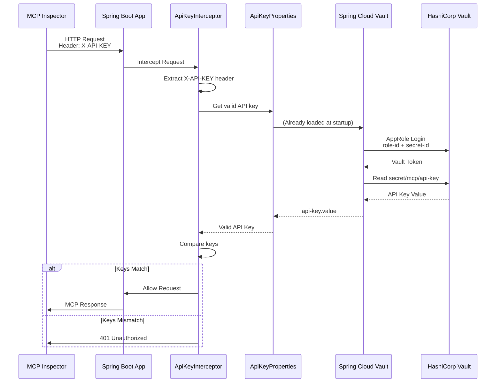
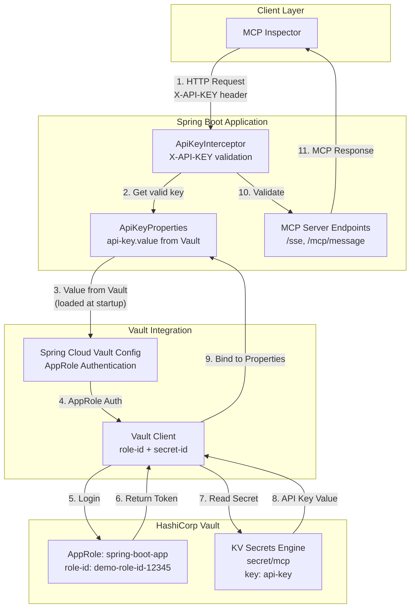

# Spring AI MCP Server with HashiCorp Vault

A secure Spring AI Model Context Protocol (MCP) server implementation using HashiCorp Vault for API key management and AppRole authentication.

[한국어 문서](README.ko.md)

## Overview

This project demonstrates how to secure a Spring AI MCP server using HashiCorp Vault for API key management. The API key is stored securely in Vault and retrieved at runtime using AppRole authentication.

**Note**: This project uses HashiCorp Vault for centralized secret management, as an alternative to the Spring Security approach described in the [DZone article on securing Spring AI MCP servers](https://dzone.com/articles/how-to-secure-a-spring-ai-mcp-server-with-an-api-k). While the DZone article demonstrates API key authentication using Spring Security with the `mcp-server-security` module, this project uses Vault for secret storage and management, providing centralized secret management, audit logging, and version control capabilities.

### Why Use Vault

**Centralized Secret Management:**
- Single source of truth for secrets across multiple services and environments
- Eliminates secret sprawl: Secrets scattered across code, config files, and multiple stores are managed in one place
- Consistent security policies: Uniform rules for rotation schedules, least-privilege access, and encryption standards across all applications

**API Key Management Comparison:**

| Aspect | With Vault | Without Vault |
|--------|-----------|---------------|
| **Storage** | Centralized, encrypted storage | Code, config files, environment variables (plaintext or simple encryption) |
| **Access Control** | Fine-grained policy-based access control | File permissions or environment variable management |
| **Audit Logging** | Automatic logging of all secret access | Manual logging or no logging |
| **Version Control** | Secret versioning and rollback support | Difficult version management |
| **Secret Rotation** | Automated rotation support (when implemented) | Manual rotation, application restart required |
| **Multi-Environment** | Automatic management of different secrets per environment | Manual management via environment variables or config files |
| **Compliance** | Audit trails and compliance requirement support | Additional implementation required |

**Advantages Over Spring Security:**

While Spring Security excels at application-level authentication and authorization, Vault provides the following advantages for secret management:

- **Centralized Management**: Unified secret management across multiple services and environments
- **Dynamic Secrets**: Support for short-lived secrets that are generated on-demand and automatically expire
- **Automated Rotation**: Automatic secret rotation for enhanced security
- **Audit Logging**: Detailed audit trails for all secret access
- **Compliance**: Support for regulatory requirements such as PCI-DSS and HIPAA
- **Encryption-as-a-Service**: Encryption/decryption services via Transit Secret Engine
- **Multiple Authentication Methods**: Support for various authentication methods including AppRole, Kubernetes, and AWS IAM

**Use Cases:**
- Microservices architecture requiring secret sharing across multiple services
- Regulated industries requiring audit trails and compliance
- Cloud/multi-cloud environments requiring consistent secret management
- Environments requiring automatic secret rotation
- Organizations needing centralized security policy enforcement

**Considerations:**
- Vault requires separate infrastructure operations and additional resources for high-availability setups
- Network latency and dependency on Vault availability
- Initial setup and learning curve required

This project demonstrates a basic implementation of API key management using Vault, and the advantages listed above can be leveraged in production environments.

## Architecture

```
MCP Inspector/Client
    │
    │ HTTP Request (X-API-KEY header)
    ▼
Spring Boot Application
    │
    ├── API Key Interceptor (validates X-API-KEY header)
    │
    └── MCP Server Endpoints (Spring AI MCP)
    │
    │ Vault API calls
    ▼
HashiCorp Vault (Docker)
    └── API Key Storage (secret/mcp, key: api-key)
```

## Prerequisites

- Docker and Docker Compose
- Java 21 or higher
- Maven 3.6 or higher

## Quick Start

Run the following command:

```bash
./setup.sh
```

This script automatically:
- Starts Vault container (skips if already running)
- Waits for Vault to be ready
- Enables KV secrets engine
- Enables AppRole authentication
- Creates AppRole for Spring Boot application
- Stores API key in Vault
- Automatically generates `.env` file and `inspector-config.json` (with Role ID, Secret ID, and API Key)
- Builds the Spring Boot application
- Starts the application and MCP Inspector
- Waits for all services to be ready

The application will start on `http://localhost:8080` and MCP Inspector will start on `http://localhost:6274`

**Fixed Demo Credentials:**
- Role ID: `demo-role-id-12345`
- Secret ID: `demo-secret-id-67890`
- API Key: Generated automatically (check `.env` or `inspector-config.json`)

**Access URLs:**
- Spring Boot Application: `http://localhost:8080`
- MCP Inspector UI: `http://localhost:6274`

### Cleanup

To clean up all containers, volumes, and generated files:

```bash
./clean.sh
```

This script:
- Stops and removes all Docker containers and volumes
- Removes generated files (`.env`, `inspector-config.json`)
- Cleans build artifacts (`target/`)

## Testing with MCP Inspector

### Install MCP Inspector

```bash
npm install -g @modelcontextprotocol/inspector
```

### Configure MCP Inspector

#### Using Docker Compose

When using Docker Compose, MCP Inspector starts automatically:

```bash
docker-compose up
```

The MCP Inspector UI is accessible at `http://localhost:6274`. 

**Note**: When using Docker Compose, the `inspector-config.json` file is generated but not automatically loaded to avoid proxy mode header issues. You need to manually connect in the UI. See the [Troubleshooting](#troubleshooting) section for details.

#### Running Locally

The `inspector-config.json` file is automatically generated during Vault initialization. It contains the API key from Vault and is ready to use:

```bash
mcp-inspector --config inspector-config.json
```

If you need to create the configuration manually, check the API key from the `.env` file:

```bash
source .env
```

Then create `inspector-config.json`:

```json
{
  "mcpServers": {
    "spring-mcp": {
      "url": "http://localhost:8080",
      "headers": {
        "X-API-KEY": "${MCP_API_KEY}"
      }
    }
  }
}
```

Alternatively, you can copy the API key directly from the `.env` file.

### Connect to Server

```bash
mcp-inspector --config inspector-config.json
```

### Test Endpoints

The server provides the following MCP tools:

- `get-server-info`: Get information about the MCP server
- `echo`: Echo back the provided message

And resources:

- `info://server`: Server information resource

### Verifying MCP Server in Inspector

Once you have MCP Inspector running (either via Docker Compose or locally), follow these steps to verify the Spring Boot MCP Server:

#### 1. Access MCP Inspector UI

Open your browser and navigate to:
- **Docker Compose**: `http://localhost:6274`
- **Local**: The URL shown in the terminal after running `mcp-inspector`

#### 2. Configure Server Connection

In the MCP Inspector UI, configure the connection in the left sidebar:

1. **Transport Type**: Select "Streamable HTTP" from the dropdown
2. **URL**: Enter `http://app:8080/mcp` (for Docker Compose) or `http://localhost:8080/mcp` (for local)
   - Note: The endpoint is `/mcp` for STREAMABLE protocol
3. **Connection Type**: Select "Via Proxy" (or automatically set)
4. **Authentication**: Click to expand the Authentication section
   - **Header Name**: Enter `X-API-KEY`
   - **Header Value**: Enter the API key from your `.env` file or `inspector-config.json`
     - You can find it by running: `grep MCP_API_KEY .env | cut -d= -f2`
     - Or check the `inspector-config.json` file
5. Click the **Connect** button

#### 3. Verify Server Connection

1. After clicking Connect, check the connection status
2. If connection is successful, you should see server information
3. If you see "Invalid Authorization Header" or 401 errors:
   - Verify the API key is correct in the Authentication section
   - Ensure the header name is exactly `X-API-KEY` (case-sensitive)
   - Check that the API key matches the one in Vault

#### 3. Test Tools

Once connected successfully, you can see multiple tabs in the MCP Inspector main screen:

**Tools Tab:**
- Click the **"Tools"** tab in the top tab menu (or use keyboard shortcut `t`)
- You should see a list of available tools:
  - `get-server-info`: Tool to get server information
  - `echo`: Tool to echo back a message

**How to Execute Tools:**
1. Click on a tool from the tools list (e.g., `get-server-info`)
2. The tool's schema and description will be displayed
3. If needed, enter parameters in the input fields:
   - `get-server-info`: No parameters required
   - `echo`: Enter a test message in the `message` field (e.g., `"Hello MCP!"`)
4. Click the **Execute** or **Run** button
5. Results will be displayed in JSON format in the bottom or right panel

**Expected Results:**
- `get-server-info` execution: Returns server name, version, status information
- `echo` execution: Returns the input message with "Echo: " prefix

#### 4. Test Resources

**Resources Tab:**
- Click the **"Resources"** tab in the top tab menu (or use keyboard shortcut `r`)
- You should see a list of available resources:
  - `info://server`: Server information resource

**How to Use Resources:**
1. Click on `info://server` from the resources list
2. Review the resource metadata (MIME type, description, etc.)
3. Click the **Read** or **Load** button to fetch the resource content
4. Verify the resource content in the results panel

#### 5. Check Logs and Debugging

1. Look for a **Logs**, **Tracing**, **Debugging**, or **JSON-RPC** tab/section
2. Check for any connection errors or authentication issues
3. Verify that requests are being made with the `X-API-KEY` header
4. If you see `401 Unauthorized` errors:
   - Verify the API key in `inspector-config.json` matches the one in Vault
   - Check that the header is being sent correctly

#### 6. Verify API Key Authentication

To confirm authentication is working:

1. Check the logs/debugging section for successful requests
2. All tool calls and resource fetches should complete without 401 errors
3. If authentication fails, you'll see `401 Unauthorized` in the logs

#### Expected Results

When everything is working correctly:

- Server appears in the Servers/Connections list and shows as connected
- **Tools** tab shows two tools: `get-server-info` and `echo`
- **Resources** tab shows one resource: `info://server`
- Tools execute successfully and return expected JSON responses
- Resources can be fetched and display the expected content
- No authentication errors (401) in the logs
- All requests complete successfully

## API Key Authentication

All MCP endpoints (`/mcp/**`) require the `X-API-KEY` header. The API key is:

1. Stored in HashiCorp Vault at `secret/mcp` with key `api-key`
2. Retrieved by Spring Boot using AppRole authentication
3. Validated by the `ApiKeyInterceptor` on each request

**Vault Secret Path:**
- Path: `secret/mcp`
- Key: `api-key`
- Read command: `vault kv get -field=api-key secret/mcp`
- Via Docker: `docker-compose exec vault vault kv get -field=api-key secret/mcp`

### Authentication Flow

The following sequence diagram illustrates the complete authentication flow:



### Component Architecture



### Code Elements Details

#### 1. ApiKeyProperties (Vault API Key Binding)

**File**: `src/main/java/com/example/mcp/config/ApiKeyProperties.java`

**How it works:**
- Spring Cloud Vault authenticates with Vault using AppRole at application startup
- Uses `VaultVersionedKeyValueOperations` to read from `secret/mcp` path
- Extracts the `api-key` key from the secret data
- Vault path: `secret/mcp` (KV v2 engine)
- Key: `api-key`
- Read command: `vault kv get -field=api-key secret/mcp`

#### 2. ApiKeyInterceptor (API Key Validation)

**File**: `src/main/java/com/example/mcp/interceptor/ApiKeyInterceptor.java`

**Validation process:**
1. Extracts API key from `X-API-KEY` header in HTTP request
2. Retrieves valid API key from `ApiKeyProperties` (loaded from Vault)
3. Compares the two values - if they match, request proceeds; otherwise returns 401 Unauthorized

**Registration**: The interceptor is registered in `WebMvcConfig` for all `/mcp/**` and `/sse` paths, excluding `/actuator/**` and `/`.

#### 3. Spring Cloud Vault AppRole Authentication

**Configuration**: `src/main/resources/application.yml`

```yaml
spring:
  cloud:
    vault:
      authentication: APPROLE
      app-role:
        role-id: ${SPRING_CLOUD_VAULT_APP_ROLE_ROLE_ID}
        secret-id: ${SPRING_CLOUD_VAULT_APP_ROLE_SECRET_ID}
```

**Authentication process:**
1. At application startup, reads role-id and secret-id from environment variables
2. Authenticates with Vault using `/auth/approle/login` endpoint
3. On successful authentication, receives Vault token
4. Uses the token to read secrets with appropriate permissions

#### 4. Vault Initialization (Fixed Demo Credentials)

**Script**: `scripts/vault-init.sh`

**Initialization process:**
1. Enables KV secrets engine
2. Enables AppRole authentication method
3. Creates AppRole and sets fixed role-id: `demo-role-id-12345`
4. Creates fixed secret-id using Custom Secret ID API: `demo-secret-id-67890`
5. Generates API key and stores it in Vault
6. Generates `.env` file and `inspector-config.json` with credentials

**Fixed Demo Credentials:**
- **Role ID**: `demo-role-id-12345` (fixed)
- **Secret ID**: `demo-secret-id-67890` (fixed, created via Custom Secret ID API)
- **API Key**: Randomly generated each time (security maintained)

### Example Request

```bash
curl -H "X-API-KEY: <your-api-key>" \
     http://localhost:8080/mcp/v1/tools
```

## Configuration

### Application Properties

The application uses Spring Cloud Vault to connect to HashiCorp Vault:

```yaml
spring:
  cloud:
    vault:
      uri: http://vault:8200
      authentication: APPROLE
      app-role:
        role-id: ${SPRING_CLOUD_VAULT_APP_ROLE_ROLE_ID}
        secret-id: ${SPRING_CLOUD_VAULT_APP_ROLE_SECRET_ID}
      kv:
        enabled: true
        backend: secret
        default-context: mcp
```

### MCP Server Configuration

```yaml
spring:
  ai:
    mcp:
      server:
        name: mcp-server
        version: 1.0.0
        type: SYNC
        protocol: STREAMABLE
        capabilities:
          tool: true
          resource: true
```

## Code Explanation

This section explains the key code components related to API key management using Vault.

### 1. ApiKeyProperties - Loading API Key from Vault

**File**: `src/main/java/com/example/mcp/config/ApiKeyProperties.java`

This class loads the API key from Vault at application startup and stores it in memory.

```java
@PostConstruct
public void init() {
    VaultVersionedKeyValueOperations kvOps = vaultOperations.opsForVersionedKeyValue("secret");
    Versioned<Map<String, Object>> secret = kvOps.get("mcp");
    if (secret != null && secret.getData() != null) {
        Object apiKeyValue = secret.getData().get("api-key");
        if (apiKeyValue != null) {
            this.apiKey = apiKeyValue.toString();
        }
    }
}
```

**Key Points:**
- `@PostConstruct`: Executes at Spring Bean initialization time, reading the API key from Vault only once
- `VaultVersionedKeyValueOperations`: Uses KV v2 engine to read versioned secrets from Vault
- **Vault Path**: `secret/mcp` (for KV v2 engine, the actual path is `secret/data/mcp`)
- **Key**: `api-key` - The key name within the secret data
- **Reading Method**: Reads the entire secret with `kvOps.get("mcp")` and then extracts the `api-key` key

**Limitations:**
- The current implementation reads only once at startup, so application restart is required if the API key is changed in Vault
- For dynamic updates, `@RefreshScope` and Spring Cloud Vault's refresh functionality can be utilized

### 2. ApiKeyInterceptor - API Key Validation

**File**: `src/main/java/com/example/mcp/interceptor/ApiKeyInterceptor.java`

This interceptor validates the API key for all MCP endpoint requests.

```java
@Override
public boolean preHandle(HttpServletRequest request, HttpServletResponse response, Object handler) {
    String providedApiKey = request.getHeader(API_KEY_HEADER);
    String validApiKey = apiKeyProperties.getValue();
    
    if (validApiKey == null || !validApiKey.equals(providedApiKey)) {
        response.setStatus(HttpServletResponse.SC_UNAUTHORIZED);
        return false;
    }
    return true;
}
```

**Key Points:**
- Extracts the API key provided by the client from the `X-API-KEY` header
- Retrieves the valid API key loaded from Vault via `ApiKeyProperties`
- Compares the two values and returns `401 Unauthorized` if they don't match
- Implements simple API key authentication without Spring Security

### 3. Spring Cloud Vault Configuration

**File**: `src/main/resources/application.yml`

```yaml
spring:
  cloud:
    vault:
      uri: ${SPRING_CLOUD_VAULT_URI:http://localhost:8200}
      authentication: ${SPRING_CLOUD_VAULT_AUTHENTICATION:APPROLE}
      app-role:
        role-id: ${SPRING_CLOUD_VAULT_APP_ROLE_ROLE_ID:}
        secret-id: ${SPRING_CLOUD_VAULT_APP_ROLE_SECRET_ID:}
      kv:
        enabled: true
        backend: secret
        default-context: mcp
        profile-separator: "/"
        application-name: mcp
        backend-version: 2
```

**Configuration Explanation:**
- `authentication: APPROLE`: Uses AppRole authentication method
- `app-role.role-id` / `app-role.secret-id`: Reads AppRole credentials from environment variables
- `kv.enabled: true`: Enables KV Secret Engine
- `kv.backend: secret`: Mount path of the Secret Engine
- `kv.application-name: mcp`: Application name (used for secret path construction)
- `kv.backend-version: 2`: Uses KV v2 engine

**Secret Path Construction:**
- Since `application-name` is `mcp`, `ApiKeyProperties` reads secrets from the `secret/mcp` path
- For KV v2 engine, the actual Vault path is `secret/data/mcp`, but Spring Cloud Vault handles this automatically

### 4. WebMvcConfig - Interceptor Registration

**File**: `src/main/java/com/example/mcp/config/WebMvcConfig.java`

```java
@Override
public void addInterceptors(InterceptorRegistry registry) {
    registry.addInterceptor(apiKeyInterceptor)
            .addPathPatterns("/mcp/**", "/sse")
            .excludePathPatterns("/actuator/**", "/");
}
```

**Key Points:**
- Applies API key validation to `/mcp/**` and `/sse` paths
- Excludes `/actuator/**` and `/` paths so health check and info endpoints are accessible without authentication

### 5. Vault Initialization Script

**File**: `scripts/vault-init.sh`

```bash
# Store API key in secret/mcp (application-name path)
# ApiKeyProperties reads from secret/mcp with key "api-key"
vault kv put secret/mcp api-key="$API_KEY" 2>&1 || true
```

**Key Points:**
- `vault kv put secret/mcp api-key="$API_KEY"`: Uses KV v2 engine to store the API key at `secret/mcp` path with the `api-key` key
- This path and key must match what `ApiKeyProperties` reads
- Uses a path that matches the `application-name: mcp` configuration

**Vault Secret Structure:**
```
secret/
  └── data/
      └── mcp/
          └── api-key: "<generated-api-key>"
```

### 6. Overall Flow Summary

1. **Vault Initialization** (`vault-init.sh`):
   - Creates AppRole and sets fixed Role ID/Secret ID
   - Generates API key and stores it in `secret/mcp` with key `api-key`

2. **Application Startup**:
   - Spring Cloud Vault reads Role ID/Secret ID from environment variables and authenticates with Vault
   - `ApiKeyProperties` reads the `api-key` key from `secret/mcp` path in `@PostConstruct` and stores it in memory

3. **Request Processing**:
   - Client sends request with `X-API-KEY` header
   - `ApiKeyInterceptor` compares the API key from the header with the valid API key from `ApiKeyProperties`
   - If they match, the request is processed; otherwise, 401 is returned

## Project Structure

```
spring-ai-mcp-server-with-an-api-key-via-vault/
├── docker-compose.yml
├── Dockerfile
├── pom.xml
├── scripts/
│   └── vault-init.sh
├── src/
│   └── main/
│       ├── java/com/example/mcp/
│       │   ├── McpApplication.java
│       │   ├── config/
│       │   │   ├── VaultConfig.java
│       │   │   ├── ApiKeyProperties.java
│       │   │   └── WebMvcConfig.java
│       │   ├── interceptor/
│       │   │   └── ApiKeyInterceptor.java
│       │   └── service/
│       │       └── McpService.java
│       └── resources/
│           └── application.yml
└── README.md
```

## Security Considerations

### Implementation Approach

This project uses the following approach for API key authentication:

- Uses **custom `ApiKeyInterceptor`** for authentication
- **No Spring Security dependency** required
- API key stored in **HashiCorp Vault** (centralized secret management)
- API key retrieved via **Spring Cloud Vault** with AppRole authentication
- API key format: `X-API-KEY: <secret>` (simple secret value)
- **Plain text comparison** (no bcrypt hashing in current implementation)
- Vault provides centralized secret management, audit logging, and version control

**Alternative Approaches:**
- Spring Security with `SecurityFilterChain` and `mcp-server-security` module
- `ApiKeyEntityRepository` for in-memory or database-backed key storage
- bcrypt hashing for API key secrets
- API key format: `X-API-key: <id>.<secret>` (ID and secret combined)

### Current Implementation

- API keys are stored only in Vault (never hardcoded)
- AppRole authentication for machine-to-machine authentication
- All MCP endpoints are protected by the API key interceptor
- Vault AppRole credentials are managed via environment variables
- For production, configure Vault properly (not dev mode)
- AppRole policies enforce least privilege principle

### Current Limitations and Vault's Value

**Important Note**: The current implementation reads the API key from Vault only once at application startup (in `@PostConstruct`). This means:

- **API key changes in Vault require application restart** to take effect
- The current implementation doesn't fully leverage Vault's dynamic secret management capabilities
- In this demo, Vault serves primarily as a secure storage mechanism rather than a dynamic secret management system

**Vault provides value in production environments:**

1. **Centralized Secret Management**: Single source of truth for secrets across multiple services and environments
2. **Audit Logging**: All secret access is logged, providing compliance and security audit trails
3. **Version Control**: KV v2 engine supports secret versioning and rollback capabilities
4. **Access Control**: Fine-grained policies control who can access which secrets
5. **Secret Rotation**: While not implemented in this demo, Vault supports dynamic secret rotation without application restarts
6. **Multi-Environment Support**: Different secrets for dev, staging, and production environments

**Future Improvements** (not implemented in this demo):

- Use `@RefreshScope` with Spring Cloud Vault to enable dynamic secret updates via `/actuator/refresh` endpoint
- Implement periodic secret refresh to pick up changes without restart
- Leverage Vault's dynamic secrets (e.g., database credentials) that rotate automatically
- Use Vault's secret leasing for time-bound access

## Troubleshooting

### Connection Error - Proxy Token Issue

If you encounter "Connection Error - Check if your MCP server is running and proxy token is correct" when using MCP Inspector:

1. **Verify MCP Server is Running**:
   ```bash
   curl http://localhost:8080/
   ```
   You should see a JSON response with server information.

2. **Check API Key**:
   ```bash
   grep MCP_API_KEY .env | cut -d= -f2
   ```
   Or check the `inspector-config.json` file.

3. **Manual Connection in MCP Inspector UI** (Recommended):
   
   The `inspector-config.json` file is not automatically loaded in Docker Compose setup to avoid proxy mode header issues. Use manual connection instead:
   
   - Open `http://localhost:6274` in your browser
   - In the left sidebar, manually configure the connection:
     - **Transport Type**: "Streamable HTTP"
     - **URL**: `http://app:8080/mcp` (correct for Docker Compose setup)
     - **Connection Type**: "Direct" or "Via Proxy" (both should work)
     - **Authentication**: Click to expand the Authentication section
       - **Header Name**: `X-API-KEY`
       - **Header Value**: Your API key from `.env` file
         ```bash
         grep MCP_API_KEY .env | cut -d= -f2
         ```
   - Click **Connect**

4. **Verify Docker Containers**:
   ```bash
   docker-compose ps
   ```
   Ensure all containers are running and healthy:
   - `vault` - Vault server (should be healthy)
   - `spring-mcp-app` - Spring Boot application (should be healthy)
   - `mcp-inspector` - MCP Inspector

5. **Check API Key Loading from Vault**:
   ```bash
   docker-compose logs app | grep -i "api.*key"
   ```
   You should see: `API key loaded successfully from Vault. Length: 43`
   
   If you see errors, check Vault policy:
   ```bash
   docker-compose exec vault vault policy read mcp-read-policy
   ```
   The policy should include both `secret/data/mcp` and `secret/data/mcp/*` paths.

6. **Check Container Logs**:
   ```bash
   docker-compose logs app
   docker-compose logs mcp-inspector
   ```
   Look for any errors or connection issues.

7. **Restart Services**:
   ```bash
   docker-compose restart app mcp-inspector
   ```

**Note**: The `inspector-config.json` file is generated but not automatically loaded in Docker Compose to avoid proxy mode header forwarding issues. Always use manual connection in the MCP Inspector UI with the API key from the `.env` file.